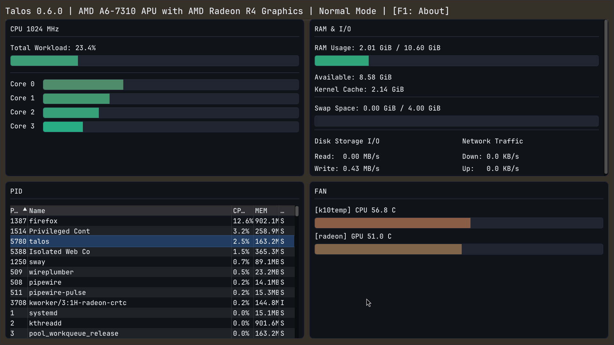
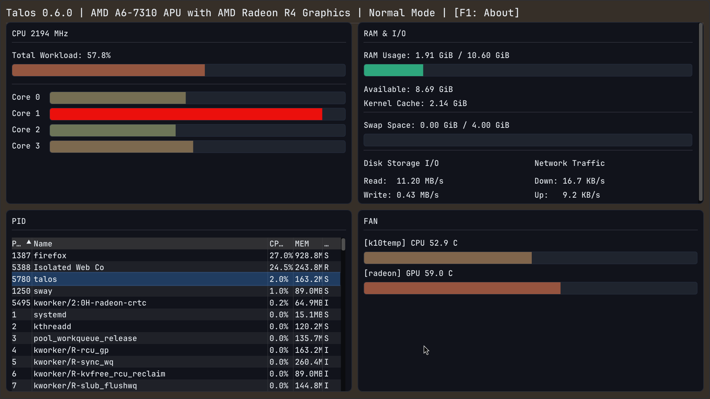

# Talos System Monitor

A native Linux system monitor.  

<p align="center">
  
  
</p>

## Prerequisites

### 1. Toolchains & Compilers
Verified working on:
* **GCC:** `16.1.1` or newer
* **Clang:** `22.1.6` or newer
* **Linker:** `mold` (Recommended)

### 2. Dependencies
Ensure the following core packages are installed via your package manager (e.g., `pacman`, `apt`):
* **SDL3** (Development headers and library files)

### 3. Build Engine
* **Storm-Knell (`sk`):** Version `>= 0.8.x`.   

---

## Quick Start & Build Pipeline

Run:

```bash
git clone --recurse-submodules https://github.com/vsix8625/talos.git   
cd talos
```

```bash
sk init strike
```

## Privileged Hardware Helpers (Optional)

Talos can adjust hardware profiles and trigger system power actions via dedicated, lightweight auxiliary binaries. 
Because these operations require elevated permissions, 
an extra installation step is required to deploy them alongside Polkit policies.

Build the project as usual via sk.
Install the secure helper utilities and their corresponding Polkit policies:

```bash
sudo ./scripts/install.sh
```

The script configures and installs:

* `talos_fanctl`: Handles adjustments to system fan profiles. Pressing F4 in the GUI cycles through available profiles.  
Talos automatically checks for driver compatibility at startup and disables the toggle if unsupported.
* `talos_power`: Connects directly to the Linux reboot() syscall interfaces using native magic tokens to execute instant machine shutdown or reboot sequences cleanly from the interface.

To completely wipe these binaries and revoke their active Polkit security permissions from the system:

```bash
sudo ./scripts/uninstall.sh
```

**Note:** Fan control profile availability depends significantly on vendor-specific driver exposure (tested working: HP `hp-wmi` exposing 2 of 6 platform states). 
System power controls triggered via `talos_power` are universally supported across standard Linux environments.

